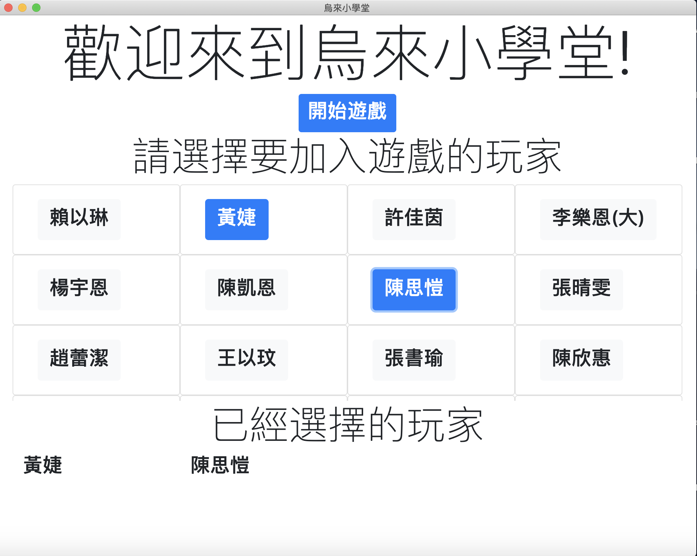
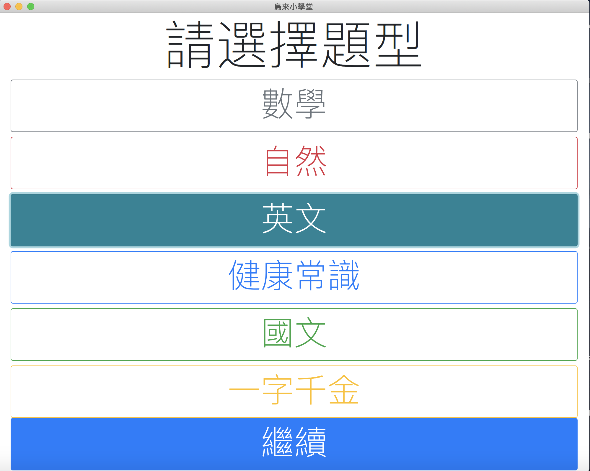
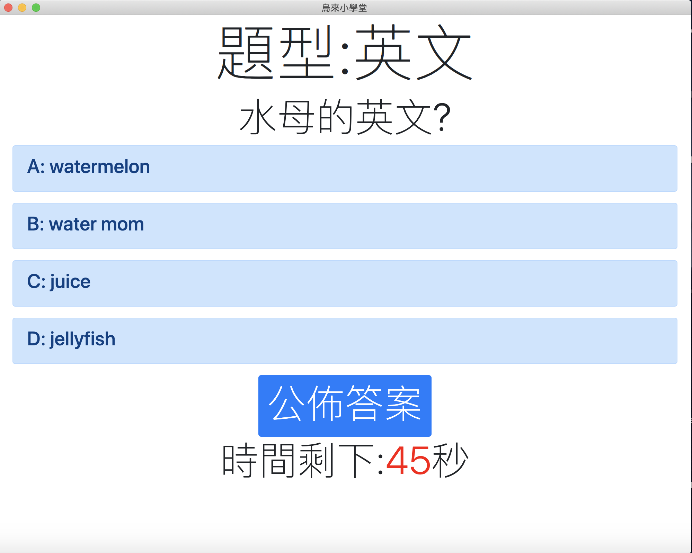
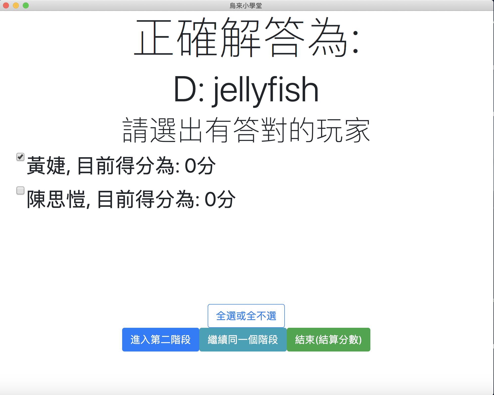
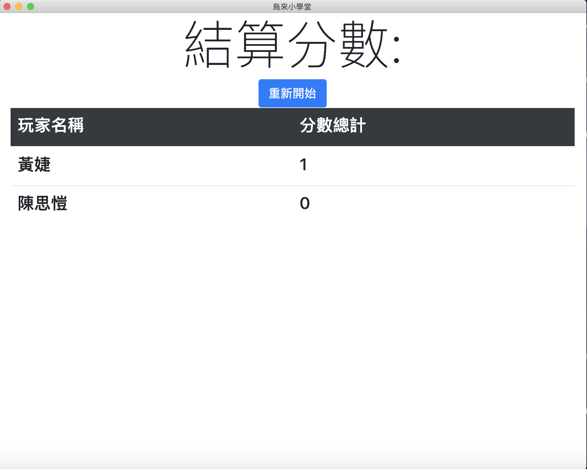

# Millionaire-class

# Demo








# How to run the code
1. Fill your player list at `./data/player.txt`(I already put the default `player.txt` there)
2. Import your own questions database at `./data/data.csv`(I already put the default `data.csv` there)
3. Run the following command in your terminal in order to install all the required packages
```
cd Millionaire-class
npm install
```
4. run the application
```
npm start
```

# Compiled Version
I build this application on these two platform by this command
```
DEBUG=electron-packager ./node_modules/electron-packager/bin/electron-packager.js --icon=./icon.icns --platform=[darwin|win32] .
```
## MacOS Application Version

<https://drive.google.com/file/d/1-wzJJb-qaQYQRG8kertKJj2jAub6GYrg/view?usp=sharing>

## Windows Application Version

<https://drive.google.com/file/d/1iLbu6d2-5V9z-Sz0IqHKpSU-1YsCGXpj/view?usp=sharing>
